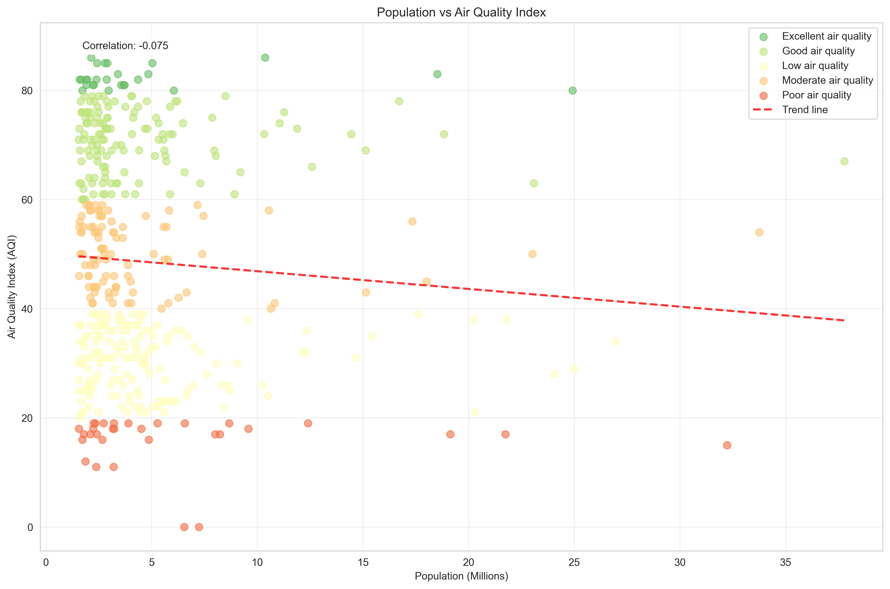
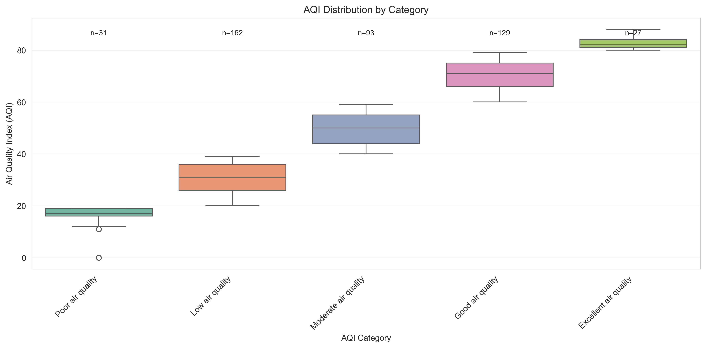

# Population vs. Air Quality in 500 Global Cities

**Contributors**
- Maclain Prom
- Diego Marquez

**Metadata Notice:**  
This project includes descriptive metadata such as dataset title, creators, publishers, usage limitations, provenance, and data dictionary in the style of the DCAT standard.

---

## IMPORTANT: Grader Instructions

**Grader should view SNAKEMAKE_README for instructions on reproduction.**

---

## SUMMARY

### **Research Question & Motivation**
This project studies whether bigger cities have worse air quality. A common assumption is that large cities are more polluted because of traffic, industry, and dense populations. While this makes sense, air quality is also influenced by geography, climate, and government policies, so population alone might not fully explain pollution differences.

To explore this, we took population data for the 500 largest cities from the SimpleMaps dataset and matched it with Air Quality Index (AQI) data from the Google Air Quality API. We compared cities of different sizes, locations, and air quality categories to see if there is a clear connection between population and pollution levels. The goal is to find out whether large cities consistently face more environmental risks, or if other factors have a stronger impact on air quality around the world.

### **Methods & Workflow Summary**
This project used a fully scripted pipeline in Python to collect, clean, and analyze the data. We started by loading the SimpleMaps World Cities dataset and checking it for missing values, duplicate cities, and invalid coordinates. From this dataset, we selected the top 500 most populated cities to use as the base list for air quality lookup.

Next, we pulled Air Quality Index (AQI) and pollutant information for each city using the Google Air Quality API. Because the API limits requests, we sometimes hit timeouts or errors. To handle this, our script included automatic retries, short waiting periods between requests, and a log to record any failed responses. Every raw API response was saved with a timestamp for future reference.

After collection, we cleaned the combined data by standardizing column names, converting values to numeric types, and checking for duplicates. We also added a `data_quality_flag` to mark which cities had complete AQI data and which were missing values. The final dataset included 496 valid cities, with about 89% containing AQI results.

We then ran exploratory analysis using a separate script that produced summary statistics, correlation results, boxplots by category, scatter trends, and a global map visualization. All steps, changes, and cleaning actions were recorded to keep the entire process reproducible and transparent.

### **Results & Interpretation**
Our results show that city population does not strongly predict air quality. The correlation between population and AQI was **–0.075**, which is basically no relationship. The scatter plot also showed a slight negative trend, meaning some very large cities actually have cleaner air than many medium-sized cities.

When looking at AQI categories, the boxplots showed big differences between groups. Cities labeled **“Excellent”** or **“Good”** mostly had AQI values around **60–85**, while **“Poor”** and **“Low”** categories were closer to **0–25**. However, these differences did not match city size. Instead, they seemed more related to location. The world map visualization showed that many Asian cities ranged from very polluted to fairly clean, while parts of Africa, South America, and Oceania often had missing or limited AQI data.

For pollutants, **PM2.5 and PM10** were the most common around the world. Outlier checks showed that some huge cities like Tokyo and Jakarta are not among the worst for air quality, while several mid-sized cities had high pollution levels. Overall, the results suggest that factors like **government policies, infrastructure, geography, and how air data is monitored** have more influence on air quality than population alone.

## DATA PROFILE

### **Data Sources**
This project uses two main datasets: the **SimpleMaps World Cities dataset** and the **Google Maps Air Quality API**. SimpleMaps provides basic city information such as name, country, coordinates, and population. We used it to identify the top 500 most populated cities around the world. The Google Air Quality API supplies real-time air quality readings, including AQI values and main pollutants for each location we request.

By combining these two sources, we can compare population size with air quality conditions instead of looking at either factor on its own. This helps us see whether larger cities actually have worse pollution, and which places experience cleaner or poorer air even if they have similar population levels.

### **SimpleMaps World Cities Dataset**
The **SimpleMaps (data provider) World Cities dataset** was used to obtain population and basic city information. It includes fields such as city name, country, latitude, longitude, population, and ISO country codes. The dataset covers over 48,000 cities worldwide, making it a strong source for identifying the most populated places. It provides a single population estimate for each city, which is useful for comparing cities at the same point in time.

We chose this dataset because it offers global coverage and has consistent formatting across countries. It allowed us to easily sort and extract the top 500 cities by population for further analysis. To ensure the data was reliable, we checked for missing population values, duplicate city–country combinations, and invalid coordinates. Cities without population data or valid geographic coordinates were removed. After cleaning, we exported only the **top 500 most populated cities**, which became the base dataset for our air quality queries.

However, the dataset has a few limitations. Population values reflect a single point in time, so we cannot analyze growth trends or historical changes. A small number of cities were missing population values and were therefore excluded. Even though the dataset includes core fields, it does not provide demographic factors like density, industry, or income, which could influence pollution levels.

There are also legal and ethical constraints. The SimpleMaps dataset is publicly available, but the **full version is a paid product, and redistribution is restricted**. For this project, we used and stored only a **derived subset** (the top 500 cities) rather than sharing the complete dataset.

### **Google Maps Air Quality API**
The **Google Maps (data provider) Air Quality API** was used to collect air quality information for each of the top 500 cities. For every set of coordinates, the API returns an AQI (Air Quality Index) value, a text category such as **“Good”** or **“Poor,”** and the dominant pollutant at that location (most commonly **PM2.5, PM10, or O₃**). Each response also includes a timestamp to document when the air quality data was collected.

The API provides **current conditions only**, meaning the results reflect air quality at the moment the request was made. AQI values are calculated using Google’s standardized scoring methods, which are similar to EPA-style air quality scales. Because the data is tied to coordinates, the accuracy depends on how well a single point represents pollution levels across an entire city.

There were several technical limitations. The API has **strict rate limits**, which caused 54 cities to return no AQI value during large-scale collection. To reduce missing data, we added **retry logic with exponential backoff** and stored all timestamped calls. Even with this fix, some cities still had no available AQI results, likely due to gaps in regional air monitoring systems.

Ethical and legal constraints also apply. The API’s terms prohibit mass redistribution of raw JSON responses or republishing the data as a standalone dataset. For this reason, we only stored and shared **cleaned, derived CSV files (not full API outputs)**. The data is used solely for analysis, not for redistribution or commercial use.

### **Reproducibility and Data Storage**
All raw API files were saved locally and backed up in **Box**. The final cleaned dataset is stored in Box with instructions on where to place it for anyone who wants to run the workflow. The full pipeline is reproducible using our Python scripts and **Snakemake**, which allows others to re-collect the data directly from the API rather than relying on redistributed files. This approach avoids licensing issues and keeps the project transparent. A **data dictionary** is also included to explain each field and how it was created.

## DATA QUALITY

### **Overview of Quality Assessment Goals**
The main goal of our quality checks was to ensure that the population and air quality data were accurate, complete, and consistent enough for fair comparison. Population data came from a static CSV file, which meant it stayed the same over time and could be fully inspected for missing values, duplicate cities, and coordinate issues. In contrast, the air quality data was collected from a live API, which introduced challenges such as rate limits, connection timeouts, and missing AQI values. Because these two sources had different types of issues, we ran quality checks both **before merging the datasets and again afterward** to confirm that all fields were valid and that no errors carried over into the final results.

### **Population Data Quality (SimpleMaps)**
The SimpleMaps dataset included over **48,000 cities**, and only a small portion were missing population values. About **251 entries had no population data**, so these were not considered when ranking cities. Since our project focused on the most populated cities, removing these entries did not affect the results.

Duplicate city–country pairs were another issue. Around **2,196 repeated names** appeared where a city was listed more than once, often due to differences in spelling or administrative subdivisions. For example, multiple versions of “Suzhou” appeared in the dataset. To avoid double counting or ranking the same city multiple times, we kept **only one instance of each city–country combination**.

We also checked geographic coordinates to make sure every city had valid values. All coordinates were within correct global ranges, but we still converted them to numeric format to prevent formatting errors during merging and analysis.

After filtering out missing values, duplicates, and inconsistent entries, we selected **only cities with valid population data and usable coordinates**, then extracted the **top 500 most populated cities**. This ensured that our air quality comparison was based on reliable and consistent population figures from major global urban areas.

### **Air Quality Data Quality (Google API)**
The air quality data came from live API calls, which introduced more uncertainty than the static population file. A total of **54 cities (about 10.8%)** returned no AQI values during data collection. This likely occurred because certain regions lack monitoring coverage or the API does not provide data at specific times. Instead of deleting these cities, we **kept them and marked them with a `data_quality_flag`**. Keeping them allowed us to still compare population and geographic patterns, even when AQI values were missing.

Rate limiting also affected data quality. Because the Google API restricts repeated requests, some calls timed out or were temporarily blocked. We used **retry logic with exponential backoff** to reduce data loss, but it did not eliminate missing values entirely. Thus, some cities may appear to have “clean” air simply because no AQI could be retrieved.

Pollutant reporting was also uneven. **PM2.5 and PM10** were the most frequently reported pollutants, while **O₃ and NO₂** appeared less consistently. Some cities lacked a dominant pollutant field altogether, which limits how deeply pollutant types can be compared across regions.

All collected values represent **real-time conditions**, not daily or annual averages. This means the AQI offers a snapshot suitable for cross-sectional comparison, but it **should not be interpreted as long-term pollution levels**.

### **Merged Dataset Quality**
After merging the population data with the air quality results, we ran a final set of quality checks. During cleaning, **16 duplicate rows** were removed using a combined city–country identifier to ensure that each city appeared only once in the dataset.

Key fields were checked for consistency. Population, AQI, and coordinates were all converted to numeric types, and coordinate ranges remained valid after cleaning. This avoided calculation errors during visualization and correlation analysis.

Completeness was also evaluated. Population and geographic fields were fully complete, but AQI coverage remained at about **89%**, due to missing or failed API responses. Instead of removing incomplete rows, we used a **`data_quality_flag`** to label missing AQI.

All transformations were logged for transparency. A **curation log** tracked every cleaning step with timestamps, and a separate **error log** documented API failures. These logs make the workflow reproducible and clarify why certain gaps exist in the final dataset.

### **Remaining Limitations and Impact on Analysis**
Some quality limitations still affect interpretation. Cities without monitoring data are more likely to appear “clean,” not because they truly have low pollution, but because the API could not return AQI values. Since the data reflects **real-time conditions**, it does not account for **seasonal changes or long-term trends** in air quality.

Additionally, a single coordinate cannot fully represent pollution variation across large metropolitan regions, where air quality can differ significantly by district or neighborhood. These limitations mean the findings should be interpreted as a **snapshot comparison**, not as an environmental ranking of global cities.

The results help identify broad patterns and relationships, but they **should not be treated as final judgments** about long-term pollution levels in any particular city.

## FINDINGS

### **Summary of Main Results**
Our results show that population alone does not strongly predict how clean or polluted a city’s air is. The correlation between city population and AQI was **–0.075**, which is extremely weak and slightly negative. This means that bigger cities are not automatically more polluted, and some even have cleaner air than smaller ones. Several large cities did not appear among the worst AQI values, while some mid-sized cities showed much poorer air quality.

These findings suggest that other factors—such as location, policies, and infrastructure—play a larger role. The next sections break down these patterns by AQI categories, regions, and pollutants.

### **Population vs AQI Relationship**
Population size is not a reliable indicator of how polluted a city’s air is. The population–AQI correlation of **–0.075** shows an extremely weak and slightly negative relationship. The trend line from the scatter plot also leaned downward, indicating that larger cities do not consistently produce higher pollution levels.

For example, megacities like **Tokyo** and **Jakarta** did not fall into the group of worst AQI values. In contrast, several mid-sized cities showed **poor air quality** despite having far fewer residents.



This disconnect suggests that pollution is influenced by more than just population. **Geographic conditions, weather, environmental regulations, public transportation, and industrial activity** all play a role. A large city with strong policies and clean infrastructure may have better air than a smaller city with outdated systems. Overall, population alone is too simple to explain global air quality differences.

### **AQI Category Patterns**
When cities are grouped by AQI categories, there is a clear separation in pollution levels. Cities labeled **“Excellent”** or **“Good”** generally fall between **60–85 AQI**, while **“Poor”** or **“Low”** categories cluster much lower—roughly between **0–25 AQI**.

These categories show real differences in air quality, but they do **not** align with population size. In other words, being a big city does **not** automatically mean falling into the **“Poor”** category.



The boxplot highlights how these categories spread out, and the differences are easy to see visually. For example, a mid-sized city can still rank in the **“Poor”** range if it has heavy industry or weak pollution standards. At the same time, a large city with stronger policies or cleaner energy can appear in the **“Good”** category. The takeaway is that category differences reflect **pollution conditions, not city size**.

### **Geographic and Regional Trends**
The geographic map and regional summary show clear differences across the world. **Asia stands out the most**, with both extremely high AQI cities and moderate ones. This means the region includes some of the worst pollution but also cleaner urban areas.

In contrast, some areas, such as parts of **Africa, South America, and Oceania**—have missing AQI values. This likely reflects **gaps in monitoring systems**, not cleaner air.


Another important detail is that countries with stronger environmental reporting may look “worse” simply because they measure pollution more frequently and accurately. The data does not always reflect actual air quality differences, but sometimes differences in tracking. 

Regional averages also show a few outliers, where moderately populated cities appear much more polluted than nearby large cities. These patterns help explain why air quality cannot be judged by population alone.

### **regional_comparison**

| Country       | Mean AQI | Median AQI | Std AQI | City Count |
|--------------|----------:|------------:|--------:|-----------:|
| Australia     | 83.25     | 84.0        | 3.10     | 4          |
| Germany       | 81.25     | 82.0        | 6.65     | 4          |
| Philippines   | 79.80     | 80.0        | 2.28     | 5          |
| Canada        | 78.00     | 81.0        | 8.89     | 3          |
| Spain         | 77.67     | 78.0        | 4.51     | 3          |
| South Africa  | 75.33     | 75.0        | 2.52     | 3          |
| United States | 72.54     | 73.0        | 6.93     | 37         |
| Japan         | 72.00     | 72.5        | 5.66     | 6          |
| Venezuela     | 70.75     | 76.0        | 13.40    | 4          |
| Brazil        | 69.33     | 70.0        | 6.38     | 6          |
| Colombia      | 66.00     | 68.0        | 8.19     | 3          |
| Indonesia     | 57.25     | 55.0        | 5.65     | 8          |
| Taiwan        | 56.00     | 55.0        | 13.39    | 6          |
| Mexico        | 55.38     | 53.5        | 12.33    | 4          |
| Turkey        | 50.25     | 52.0        | 15.06    | 8          |

### **Dominant Pollutants and Outliers**
Across the dataset, **PM2.5** and **PM10** are the most common dominant pollutants in cities with poor air quality. These fine particles are linked to **traffic, industry, and burning fuels**, which explains why they appear so often in polluted areas. What stands out is that some of the worst AQI values do **not** come from the biggest cities.

Several **mid-sized cities** rank higher on pollution than large global cities with millions more people. The same pattern appears on the cleaner side as well, with some **megacities showing fairly strong air quality**, while some **smaller cities fall into the “Poor” or “Low” categories**. This shows that population alone is **not a reliable way to judge air quality**.

### **Outliers Summary (CSV)**

| Metric             | City   | Country       | Value       |
|--------------------|--------|---------------|-------------|
| Highest Population | Tokyo  | Japan         | 37,785,000  |
| Worst Air Quality  | Munich | Germany       | 88.0        |
| Best Air Quality   | Riyadh | Saudi Arabia  | 0.0         |

## Data Collection and Acquisition Documentation

This project uses two sources:  
SimpleMaps World Cities (population and coordinates)  
Google Maps Air Quality API (AQI values, categories, and pollutants)

### How to Acquire the SimpleMaps Data
Download worldcities.csv from:  
https://simplemaps.com/data/world-cities

Save it to:  
`data/worldcities.csv`

(Optional but recommended) verify file integrity:

```bash
shasum -a 256 data/worldcities.csv    # macOS/Linux
```

### How to Acquire Air Quality Data (Programmatically)

Create a Google Cloud account and enable the Air Quality API.

Add your API key to `config.yaml` following the format shown in `config_template.py`.

Make sure `config.py` is listed in `.gitignore`.

To collect AQI data automatically, run from the project root:

```bash
python run_all.py
```
This script (together with `full_collection.py`, `collect_air_quality.py`, and the Snakemake workflow):

- loads the top 500 populated cities  
- sends API requests using `requests`  
- saves raw city and AQI data (`data/raw_top_500_cities.csv`, `data/raw_air_quality_YYYYMMDD_HHMMSS.csv`)  
- writes error and curation logs (`data/collection_errors_YYYYMMDD_HHMMSS.csv`, `data/curation_log_YYYYMMDD_HHMMSS.csv`)  
- outputs cleaned, integrated results as CSV in `data/`

**If you already downloaded our processed data from Box, place the files in `data/` and simply run:**

```bash
pip install -r requirements.txt
pip install snakemake
snakemake --cores 1
```
Snakemake will detect existing outputs and skip live API collection automatically.

This script:
- loads the top 500 populated cities,
- sends API requests using `requests`,
- saves raw responses and error logs with timestamps,
- outputs cleaned results as CSV in `data/`.

## Storage and Organization Documentation

This project uses a structured filesystem where all data, logs, and visualizations are saved automatically by the pipeline. You only need to place `worldcities.csv` in `data/`; the other files are created by the scripts.

### **Project Folder Structure**

```
FinalSub/
├── LICENSE
├── README.md
├── ProjectPlan.md
├── SNAKEMAKE_README.md
├── Snakefile
├── requirements.txt
├── config.yaml
├── config_template.py
├── run_all.py
│
├── acquire_data.py
├── collect_air_quality.py
├── clean_and_integrate.py
├── analysis_and_viz.py
├── full_collection.py
│
├── data_dictionary.md
└── data/
    ├── worldcities.csv
    ├── raw_top_500_cities.csv
    ├── top_500_cities.csv
    ├── raw_air_quality_YYYYMMDD_HHMMSS.csv
    ├── integrated_cities_air_quality_final.csv
    ├── descriptive_statistics.csv
    ├── correlation_matrix.csv
    ├── regional_comparison.csv
    ├── outliers_summary.csv
    ├── curation_log_YYYYMMDD_HHMMSS.csv
    ├── collection_errors_YYYYMMDD_HHMMSS.csv
    │
    └── viz/
        ├── population_vs_aqi.png
        ├── population_distribution.png
        ├── geographic_distribution.png
        ├── aqi_distribution.png
        └── aqi_by_category.png
```
### Naming Conventions

- Input files use original source names (e.g., `worldcities.csv`).

- Derived and cleaned files use descriptive names, e.g.:
  - `top_500_cities.csv`
  - `integrated_cities_air_quality_final.csv`

- Logs are timestamped CSVs stored in `data/` and include:
  - `curation_log_*.csv`
  - `collection_errors_*.csv`

- Visualizations are PNG files in `data/viz/` with descriptive names (e.g., `population_vs_aqi.png`).

## Data Integration Documentation

The SimpleMaps population data and Google Air Quality API results are merged using **city name + country** as a composite key. All integration is performed programmatically using Python.

### Integration Process (Step-by-Step)

1. Load cleaned population data from `data/worldcities.csv`.
2. Filter to valid records (non-missing population, valid coordinates).
3. Select the top 500 cities by population and save as `data/top_500_cities.csv`.
4. Load AQI results from the API output (`data/raw_air_quality_*.csv`).
5. Standardize column names and formats.
6. Convert numeric fields (population, AQI, latitude, longitude) to numeric types.
7. Normalize text columns (city names, country labels) for consistent joins.
8. Merge population and AQI data on **city + country**.
9. Add integration metadata:
   - `data_quality_flag` to mark missing AQI values  
   - `collection_timestamp` for when AQI was collected
10. Export the final integrated dataset as:  
    ```
    data/integrated_cities_air_quality_final.csv
    ```

### Script Used
`clean_and_integrate.py` – performs filtering, type conversion, merge, and export.

## Data Quality and Cleaning Documentation

All quality profiling and cleaning steps were performed using reproducible Python scripts. **Data was not edited manually.**

### Quality Profiling (Step-by-Step)

- Inspect population data (`worldcities.csv`)
- Check for missing population values
- Check for duplicate city–country pairs
- Validate coordinate ranges (lat/long within valid bounds)
- Inspect air quality data (API results)
- Track failed or missing requests in an error log
- Check completeness of AQI and pollutant fields
- Record response timestamps
- Profile the merged dataset
- Summary statistics and correlation checks
- Count missing AQI values and pollutant coverage
- Identify outliers (extreme AQI or population values)

*All profiling was performed in `analysis_and_viz.py`.*

### Cleaning Actions (Step-by-Step)

- Remove invalid population records
- Drop cities with missing population values
- Keep only valid coordinates
- Deduplicate by city + country
- Remove duplicate city entries (retain one per country)
- Standardize column formats
- Convert numeric fields (population, AQI, latitude, longitude)
- Normalize string values for consistent merging
- **Preserve incomplete rows**
- Instead of deleting missing AQI values, assign a `data_quality_flag`
- Output cleaned data

**Final export:** `data/integrated_cities_air_quality_final.csv`

*All cleaning was performed in `clean_and_integrate.py`.*

### OpenRefine Usage

We did **not** use OpenRefine.

All profiling and cleaning is **scripted and reproducible**, eliminating manual edits.

## Data Analysis and Visualization Documentation

All analysis and visualizations were generated from scripts; **no plots or statistics were created manually.**

### Analysis Steps (Step-by-Step)

- Load `data/integrated_cities_air_quality_final.csv`.

- Compute basic statistics:
  - mean, median, min/max AQI
  - distribution of dominant pollutants
  - number of cities missing AQI (via `data_quality_flag`)

- Compute correlation:
  - Pearson correlation between population and AQI
  - save to `data/correlation_matrix.csv`

- Identify outliers:
  - cities with unusually high/low AQI relative to population
  - save results to `data/outliers_summary.csv`

- Summarize by region and save as `data/regional_comparison.csv`.

*All analysis functions are in `analysis_and_viz.py`.*

### Visualization Steps (Step-by-Step)

- **Scatter plot – Population vs AQI** (`population_vs_aqi.png`)  
  shows the weak negative correlation.

- **Population distribution** – histogram or density plot (`population_distribution.png`).

- **AQI distribution** – histogram (`aqi_distribution.png`).

- **AQI by category** – boxplot grouped by AQI category (`aqi_by_category.png`).

- **Geographic map** – cities plotted by latitude/longitude with color by AQI (`geographic_distribution.png`).

*All plots are automatically saved to `data/viz/` and are generated in `analysis_and_viz.py` using matplotlib and seaborn.*

## Workflow Automation and Provenance

This project is fully reproducible using a scripted workflow. All data collection, cleaning, integration, analysis, and visualization steps are automated using **Python and Snakemake**.

### Automated Workflow Components

| File / Folder | Purpose |
|---------------|---------|
| `Snakefile` | Snakemake workflow that defines rules from collection → visualization |
| `SNAKEMAKE_README.md` | Explains how to run the Snakemake workflow |
| `run_all.py` | “Run All” convenience script that orchestrates the full workflow |
| `full_collection.py` | Helper for collecting population + AQI data |
| `acquire_data.py` | Helper for acquiring and staging input data |
| `collect_air_quality.py` | Helper for calling the Google Air Quality API |
| `clean_and_integrate.py` | Implements cleaning and integration logic |
| `analysis_and_viz.py` | Implements analysis and visualization logic |
| `config.yaml` | Runtime configuration (e.g., API key placeholder, paths, options) |
| `config_template.py` | Example Python config module showing how keys and options are structured |
| `data/*.csv`, `data/viz/*.png` | Outputs, logs, and visualizations produced by the workflow |

### How to Reproduce the Workflow (Step-by-Step)

1. Download the SimpleMaps dataset and save it as: data/worldcities.csv

2. *(Optional)* If you want to re-collect live AQI data:
- Add your Google Air Quality API key to `config_template.py`
- Do **not** upload `config.py` (API key) to GitHub.

3. Install required Python libraries:
```bash
pip install -r "requirements.txt"
```
4. Run the full automated workflow as outlined by **SNAKEMAKE_README**

This script:
- Collects AQI data (depending on how `Snakefile` is ran)
- Cleans and integrates datasets
- Generates analysis CSVs + visualizations
- Logs all provenance information

### Provenance Tracking

The workflow automatically records:
- Failed API requests (`data/collection_errors_*`)
- All cleaning actions with timestamps (`data/curation_log_*date*`)
- Generated analysis outputs (`data/`, `data/viz/`)

This ensures the data’s origin and transformations are **fully traceable and reproducible**.

## FUTURE WORK

### Lessons Learned
One of the biggest strengths of this project was building everything through reproducible scripts. Using Python and Snakemake made it easy to run the entire pipeline from data collection to analysis without manually fixing files. The curation log and error log also helped a lot. Instead of hiding missing data, every issue was recorded, which made the dataset more honest and easier to explain. Keeping rows that were missing AQI values turned out to be useful too, since removing them could have created a false picture of certain regions.

There were also challenges. The Google API often hit rate limits, especially during larger scale collection. This slowed the process and created gaps in places with weaker monitoring. Real-time results were unpredictable in cities without strong sensor networks, so the “live” data was not fairly reliable across the world. On the population side, the SimpleMaps data only represents one moment in time. Big and growing cities may already have changed since that snapshot.

The main takeaway is that cleaning and transparency matter more than having a “perfect” dataset. Real-time environmental data sounds ideal, but it comes with uneven coverage and uncertainty. Therefore, building clear logs and labeling incomplete data was just as important as the analysis itself.

### Improvements for Future Data Collection
A major improvement for future work would be **collecting air quality at multiple points in time** instead of a single moment. AQI levels can change based on weather, season, or daily activity, so weekly or seasonal snapshots would give a more accurate view of long-term conditions.

Another fix would be to **use backup sources** for cities that return no data. Organizations like **WHO, OpenAQ, or national governments** publish AQI and pollutant data, which could fill gaps when the Google API fails.

The data could also become more realistic by **looking inside cities** rather than treating each one as a single point. Megacities like Tokyo probably have different pollution levels in different neighborhoods. Using weighted sampling or collecting data at multiple coordinates would show that pollution can be unequal within the same city.

Missing data can also be handled better. Instead of only flagging missing values, future versions could **estimate values using neighboring cities, similar climates, or typical pollutant levels**. It would also help to track **which pollutants are missing**, not just whether AQI is missing.

Also, a **quality score** could be added to show how reliable each city’s AQI reading is based on monitoring coverage or return frequency. This would make the dataset not only larger, but more trustworthy.

### Deeper Research Questions
This project mainly focused on population, but future research could study whether **government policies and infrastructure** play a bigger role than city size. For example, a study could compare cities with strict emissions rules to cities with weak enforcement and see if regulation matters more than population or geography.

Another area worth exploring is **how climate and location affect air quality**. Different environments may create different pollution patterns. Desert regions might have more dust pollution, while coastal cities might benefit from wind patterns that naturally disperse pollutants. Mountainous cities could struggle with pollutants settling in basins.

Dominant pollutants could also be studied by region. For example, are Asian cities more affected by industrial pollutants? Do coastal regions have more ozone issues? Tracking pollutants by region could show whether different parts of the world face different environmental risks.

It is also worth mentioning that deeper study could look at **inequality within cities**. Air quality might be very different between low-income neighborhoods and wealthier areas. Collecting AQI at multiple points in a single city could show whether pollution exposure lines up with income, population density, or zoning rules. Future work could even build models that **predict how city growth, traffic, or climate change might shape air quality over time.**

## REPRODUCING (Sequence of Steps)

### Set up Python and dependencies
- Make sure you have **Python 3.11 or later** installed.

- Install required Python libraries  

From the project folder, run:
```bash
pip install pandas numpy requests matplotlib seaborn
```
### Install required Python libraries

From the project folder, run:
```bash
pip install pandas numpy requests matplotlib seaborn
```
### (Optional) Get a Google Air Quality API key

You only need this if you plan to **re-collect air quality data**.

- Create a Google Cloud account and enable the **Air Quality API**.
- Copy your API key.

### Add your API key to the config file

- Open `config_template.py`.
- Add your API key in the same format shown in the template.
- Save it (either keep the same name or follow whatever your script expects).

### Add the SimpleMaps world cities file

- Download `worldcities.csv` from SimpleMaps.
- Save it into the project at:  
  `data/worldcities.csv`

You don’t need to create any extra folders; the scripts will make what they need.

### Quick start with Snakemake

From the project root, run:
```bash
pip install -r requirements.txt
pip install snakemake
snakemake --cores 1
```
### What the pipeline does

- Collects AQI data (if API key is set up).
- Cleans and integrates the population and AQI data.
- Runs analysis and generates visualizations.
- Saves logs and outputs.

### Where outputs are saved

**Final integrated data:** data/integrated_cities_air_quality_final.csv

**Visualizations (PNG plots):** data/viz/

**Logs and provenance (errors, curation):** curation_log_*   collection_errors_*

### FOR GRADING PURPOSES  
**FOLLOW INSTRUCTIONS OUTLINED IN `SNAKEMAKE_README`**

## BOX LINK

All final cleaned data and analysis outputs are stored in a shared Box folder at:  
https://uofi.box.com/s/3ack9guo8cf8tor8avg8orh13m9g59zm 

The folder includes the merged dataset (`integrated_cities_air_quality_final.csv`), as well as analysis outputs such as `correlation_matrix.csv`, `regional_comparison.csv`, and a **Visualizations** folder containing all generated PNG plots.

To reproduce our results, these files should be downloaded and placed into the project directory so that:
- the CSVs are located in the `data/` folder
- the visualization files are placed in `data/viz/`

Once the files are in these locations, the full workflow can be reproduced **without recollecting AQI data** by running:

```bash
pip install -r requirements.txt
pip install snakemake
snakemake --cores 1
```
## DATA DICTIONARY

A detailed data dictionary for `data/integrated_cities_air_quality_final.csv` is provided in:

- `data_dictionary.md`

It describes each column (**city, country, iso2, iso3, latitude, longitude, population, aqi, aqi_category, dominant_pollutant, data_quality_flag, collection_timestamp**), including type, source, and meaning.

## CONTRIBUTIONS

We worked together on every part of the project, including planning, writing, coding, and reviewing each step. We both helped build the pipeline and analyze the results, but we each focused on different tasks:

- **Maclain Prom** mainly worked on collecting the air quality data from the Google API. He set up the retry system, handled rate limits, and helped set up the Snakemake workflow.

- **Diego Marquez** mainly worked on cleaning the SimpleMaps population data and merging it with the AQI results. He also made the visualizations and wrote explanations in the findings.

We checked each other’s work and made all final decisions together. **Both of us contributed equally to the project.**

## REFERENCES

Google. (2024). *Google Maps Air Quality API* [Data set]. Google LLC. https://developers.google.com/maps/documentation/air-quality  

SimpleMaps. (2024). *World Cities Database* [Data set]. SimpleMaps. https://simplemaps.com/data/world-cities  

AirNow. (2024). *Air Quality Index (AQI) Basics.* U.S. EPA. https://www.airnow.gov/aqi/aqi-basics/  

Python Software Foundation. (2024). *Python (Version 3.11)* [Computer software]. https://www.python.org/  

McKinney, W. (2010). *Data structures for statistical computing in Python.* Proceedings of the 9th Python in Science Conference. https://pandas.pydata.org/  

Hunter, J. D. (2007). *Matplotlib: A 2D graphics environment.* Computing in Science & Engineering, 9(3), 90–95. https://matplotlib.org/  

Köster, J., et al. (2022). *Snakemake: A scalable workflow management system.* EMBL. https://snakemake.github.io

